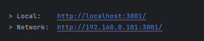

[//]: # (BEFORE YOU READ THIS!!!)

[//]: # (
I wrote this markdown in my local machine, same as I have done for the rest of the project,
but it seems that when I use the 'Open Preview' option in StackBlitz it does not show as it does
in Visual Studio Code or Jetbrains Webstorm, I used both of these to test the particular issue.
Maybe I am giving it too much of importance but anyway, I thought it mightt be relevant for whomever
is grading this challenge.
)

# Cologne Zoo

The Cologne Zoo application provides a summary of the animals and their relevant health data.
It serves as a tool for zookeepers to get an overview of the animals in the zoo.
This document provides information on how to use it.

***

## Table sample with the data:
| Index | Species   | Name       | Gender | Age (yrs) | Birthdate                 | Favourite Fruit | Weight (kg) | Height (m) | Food/Day (kg) |
|-------|-----------|------------|--------|-----------|---------------------------|-----------------|-------------|------------|---------------|
| 1     | bird      | Adrienne   | female | 19        | 2004-11-21T20:15:10.903Z | apple           | 54          | 1.58       | 0.22          |
| 2     | insect    | Alton      | male   | 21        | 2003-01-14T18:58:35.508Z | cherry          | 210.4       | 0.35       | 34.11         |
| 3     | horse     | Ashley     | female | 23        | 2000-11-12T00:46:41.640Z | cherry          | 244.1       | 1.64       | 28.49         |
| 4     | cow       | Audrey     | female | 16        | 2007-10-03T00:25:52.154Z | banana          | 56.6        | 2.28       | 0.24          |
| 5     | rabbit    | Becky      | female | 22        | 2002-01-09T22:14:17.673Z | banana          | 194.7       | 0.27       | 0.39          |
| 6     | insect    | Brad       | male   | 6         | 2017-11-18T23:55:21.476Z | apple           | 87.2        | 2.02       | 0.43          |
| 7     | snake     | Cecil      | male   | 2         | 2021-07-01T21:00:07.161Z | cherry          | 241.4       | 3.76       | 34.78         |
| 8     | cow       | Charlotte  | female | 8         | 2015-08-02T19:46:31.334Z | apple           | 34.2        | 2.26       | 0.15          |
| 9     | rabbit    | Charlotte  | female | 10        | 2013-10-17T12:11:33.702Z | apple           | 142.4       | 0.87       | 0.57          |
| 10    | cetacean  | Connie     | female | 5         | 2019-05-16T15:16:35.249Z | cherry          | 123.7       | 2.63       | 28.51         |

***

## Why use Cologne Zoo app? 

One of the main reasons why you as a zookeeper should use the Cologne Zoo app for maintaining your animals health is 
that the UI itself is pretty user-friendly and straightforward. Every information about the animal you want to see is 
right there, in the tip of your fingers. The numbers are quite big for you to see and the animal you want to select is 
highlighted with a nice shade of yellow when you hover the mouse over that animal. Amongst all of these points, there 
is one that you would rarely find in another zoo maintenance site, the costumer service. The site is maintained and 
developed by SIDESTREAM, and the admin of the page is always at you service no matter how small the issue is. 

***
## Getting ready:

In order to use the application you first need to download this repository in your local machine, or you can use an
online tool such as `git` in combination with [StackBlitz](https://stackblitz.com/) or
[GitHub Codespaces](https://docs.github.com/en/codespaces/overview). In this documentation, we are assuming that you are
going to use the first method, locally, and we are assuming you have `npm` installed. If not, then just click here --->
[<kbd>NPM</kbd>](https://docs.npmjs.com/downloading-and-installing-node-js-and-npm). You will be redirected to Node's
package manager official documentation website, which should be sufficient for you to install `npm` in your local
machine and be ready to finally run the project.

### Using npm:
After downloading the repo in you local machine and successfully extracting it (assuming it is a .zip file), you can
just go to the directory by using a command similar to this:

```shell
cd ~/Downloads/$REPO_NAME
```

To run the app simply run:
```shell
npm run dev
```

After this you should see a section similar to :



Just click in either one of these two links, and it should open the application in your default browser.
To close the app, press <kbd>CTRL + C</kbd> simultaneously and server will close.

***

## Developers: `NPM` list of all the commands 

All of these can also be found in the `package.json` file in the project directory.

```json
"dev": "nuxi dev",
"build": "nuxi build",
"start": "node .output/server/index.mjs",
"lint": "npm-run-all lint:*",
"lint:types": "nuxi typecheck",
"lint:style": "eslint .",
"test": "vitest --run",
"test:watch": "vitest",
"prepare": "husky install",
"test-for-reviewer": "npm run build && npm run test",
"hello": "echo 'Hi IT Director! Open TASKS.md to get started'"
```


